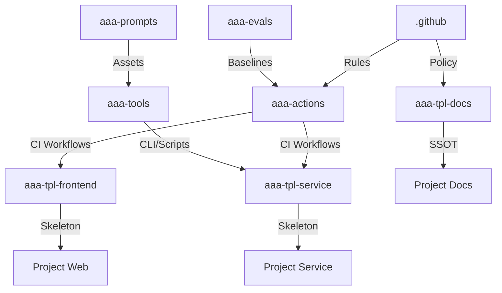

# ai-asset-architecture (aaa)

> **"From High-Depreciation Skills to Low-Depreciation Assets"**
> 本組織致力於建構可重用、可演進的 AI 協作資產庫。

## Purpose / Scope
Org-level governance entrypoint and default community health files for all repos in the organization.

## Ownership / CODEOWNERS
Owned by `@aaa/architect` and `@aaa/platform`. See `CODEOWNERS`.

## Versioning / Release
Changes to governance rules and templates are versioned via git tags when policy changes are made.

## How to Consume / Use
GitHub automatically applies this repo's templates and policies across the organization.

## Contribution / Promotion Rules
All changes require review by org admins and must stay aligned with `GOVERNANCE.md`.

## Start Here
- Bootstrap protocol: `BOOTSTRAP_PROTOCOL.md`
- Governance baseline: `GOVERNANCE.md`
- Docs SSOT: `aaa-tpl-docs`
- New project SOP: `aaa-tpl-docs/docs/new-project-sop.md`
- 人類先看 `new-project-sop.md`，Codex 再讀 `aaa-tools/runbooks/init/AGENT_BOOTSTRAP.md`

## 🏗️ Architecture Topology (架構拓樸)

本組織採用 **「模板生成 + 中央引用」** 的星狀架構。所有專案皆由模板生成，並持續引用中央資產。

### 核心 Repo 結構與相依性

---

## 🚀 Bootstrap Sequence (建設與初始化順序)

若需重建本組織或理解相依關係，請遵循以下 **最小可用 (MVP)** 初始化路徑：

### Phase 1: Foundation (基石)

1. **`[Governance]` .github**
* **內容**: PR/Issue 模板, `GOVERNANCE.md`, `CODEOWNERS`.
* **目的**: 定義權限、團隊與協作規則。

2. **`[Pipeline]` aaa-actions**
* **內容**: Reusable workflows (`lint`, `test`, `eval`, `release`).
* **關鍵**: 必須先打上 `v0.1.0` tag，後續模板才能引用。

### Phase 2: Core Assets (核心資產)

3. **`[Tools]` aaa-tools**
* **內容**: CLI stub (`aaa --version`), Sync 邏輯.
* **目的**: 統一的工具介面。

4. **`[Quality]` aaa-evals**
* **內容**: 最小 eval suite, baseline data.
* **目的**: 定義什麼是「好」。

5. **`[Intelligence]` aaa-prompts**
* **內容**: Prompt schema, 範例 prompts.
* **目的**: AI 的大腦配方。

### Phase 3: Templates (生產模具)

6. **`[Brain]` aaa-tpl-docs**
* **內容**: `ACC` (憲法), `PP` (法律), `.ai-context.md`, PRD/ADR 模板.
* **目的**: 專案的大腦與規劃中樞 (SSOT)。

7. **`[Body]` aaa-tpl-service**
* **內容**: Backend 骨架, `ci.yml` (呼叫 `aaa-actions`).
* **目的**: 快速啟動後端服務。

8. **`[Face]` aaa-tpl-frontend**
* **內容**: Frontend 骨架, `ci.yml` (呼叫 `aaa-actions`).
* **目的**: 快速啟動前端應用。

---

## 📚 Documentation

* **Governance Rules**: 請參閱 [GOVERNANCE.md](GOVERNANCE.md) 了解 Branch Protection 與 Team 權責。
* **Asset Contribution**: 請參閱各 Asset Repo 的 `CONTRIBUTING.md`。

---

*Generated by ai-asset-architecture bootstrap process.*
